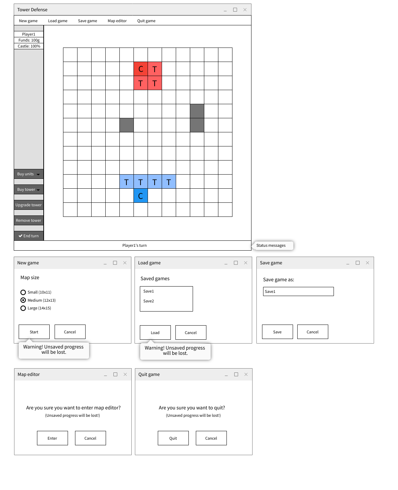

# **Tower Defense**

Követelményelemzés és tervezés

Készítők: Acceptable4

2022.02.28.

# **Tartalom**

[**Megvalósíthatósági terv**](#megvalósíthatósági-terv)

[**Funkcionális specifikáció**](#funkcionális-specifikáció)

[**Nem funkcionális specifikáció**](#nem-funkcionális-specifikáció)

[**Komponens diagram**](#komponens-diagram)

[**Oszály diagram**](#osztály-diagram)

[**Felhasználói felület terv**](#felhasználói-felület-terv)

[**Use case diagram**](#use-case-diagram)

[**User Stories**](#user-stories)

# **Megvalósíthatósági terv**

- **Humán erőforrások:**
  - Egy termékgazda (4 óra)
  - Scrum master (8 óra)
  - 4 tervező/fejlesztő (40 óra/fő)
- **Megvalósítás időtartama:**
  - 4+8+4\*40 = 172 munkaóra
- **Hardver erőforrások:**
  - 4 Számítógép a fejlesztőknek, közepes hardverigénnyel
- **Szoftver erőforrások:**
  - **Operációs rendszer:** Windows 10/11
  - **Fejlesztőkörnyezet:** Visual Studio 2019/2022
  - **Keretrendszer:** :WinForms
  - **Verziókövetés:** Git, Gitlab
  - **Feladatmenedzsment:** Trello
- **Üzemeltetés, karbantartás:**
  - **Üzemeltetés:** A program nem igényel üzemeltetést, indítás után használatra kész.
  - **Karbantartás:** A program az esetleges használat közbeni hibák kijavításán kívül más karbantartást nem igényel.

# **Funkcionális specifikáció**

- **Választott részfeladatok:**
  - Tornyok fejlesztése
  - Barakkok megvalósítása
  - Perzisztencia
  - Térképszerkesztés

- **Általános:**

  - Új játék indítása, vagy kilépés az alkalmazásból
  - Mindenkori játékállás megjelenítése (arany, seregállapot, pontok)
  - Játékidő mérése
  - Választás a generált pályák közül
  - Pálya betöltése
  - Régebbi játék folytatása
  - A játék végének felismerése (kastély összeomlik)

- **Játékmenet:**

  - Tervező mód – pálya építése: méret, kialakítás megadása és tárolása
  - Építkezés a játék elején – adott cellára kattintva a kiválasztott objektum &quot;helyeződik&quot; le
  - Vásárlás esetén a játékos aranya csökken, nem vehet drágábbat, amint amennyi pénze van (az arany mennyisége a feladatkiírás szerint alakul)
  - Váltakozás a két játékos között
  - Aktuális játékos nevének megjelenítése
  - Lépés a játékban a pozíció megadásával (cellára kattintás)
  - Az egységek a legrövidebb úton közelítik meg a célt
  - Kastély erejének csökkentése, ha az ellenfél rálép
  - Egység kiiktatása, ha az ellenfél kastélyára lép
  - A tornyokra lépés nem engedélyezett
  - Egység kiiktatása, ha az életereje elfogy
  - A torony tüzet nyit az ellenfélre, ha az hatókörébe kerül
  - Sebződés esetén életerő csökkentése
  - Terepi akadályra navgiáláskor a lépés nem történik meg
  - Terepi akadályok szűk környezetébe nem lehet kastélyt helyezni

# **Nem funkcionális specifikáció**

- **Hatékonyság:**
  - Jelentéktelen terhelés a processzor, memória és háttértár részére,
  - Hálózatot nem igényel
  - Gyors (1 másodperc alatti) válaszidő minden bevitelre egy alsó kategóriás számítógépen
- **Megbízhatóság:**
  - szabványos használat esetén nem fordul elő hibajelenség, nem jelenik meg hibaüzenet
  - hibás emberi bevitel esetén hibaüzenet és a bevitel megismétlése
- **Biztonság:**
  - nem releváns
- **Hordozhatóság:**
  - A legtöbb személyi számítógépen biztosított a használat, így Windows 7, 8, 10, 11 esetén, de külön alkalmazásként
  - Nem igényel külön telepítést, azonnal használható
- **Felhasználhatóság:**
  - Intuitív felhasználói felület, megfelelő instrukciókkal
  - Külön segédlet, vagy leírás nem szükséges a használathoz
- **Környezeti:**
  - .NET, WinForms keretrendszer szükséges a futtatáshoz
- **Működési:**
  - Általában rövid futási idő, maximum 1-2 óra
  - Gyakori használat
- **Fejlesztési:**
  - C# nyelv, Visual Studio 2019/2022, vagy Rider környezet
  - WinForms keretrendszer
  - Objektumorientált paradigma

# **Komponens diagram**

# **Osztály diagram**

# **Felhasználói felület terv**

- **Játék**

- **Tervező mód**

# **Use case diagram**

# **User Stories** 

